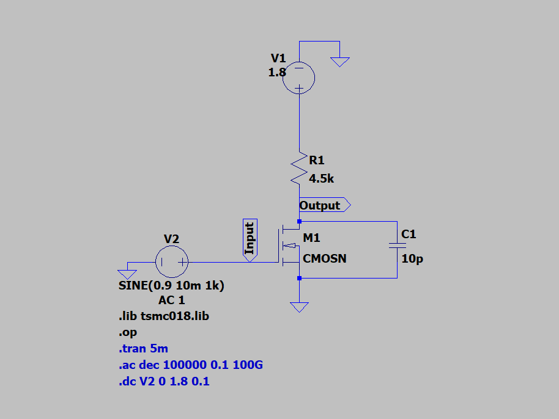
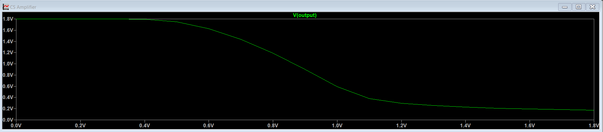
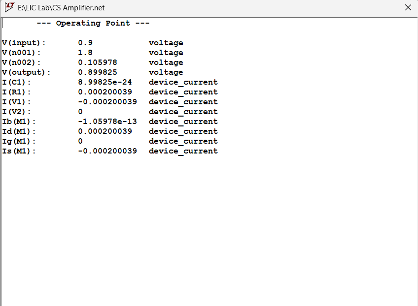
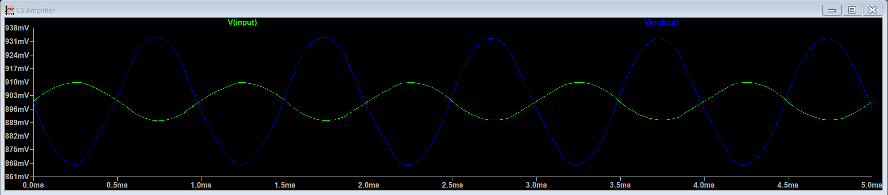
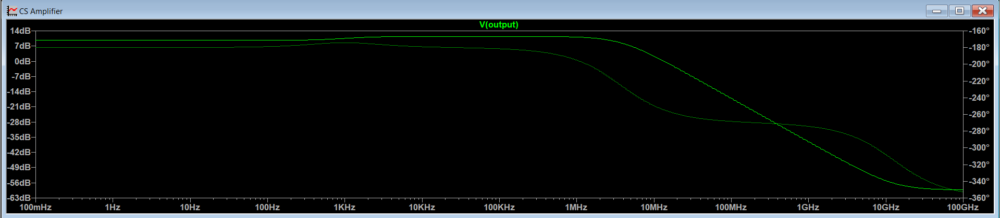

# Experiment 1
## DC, AC and Transient Analysis of Common Source Amplifier

### AIM

To design a Common Source (CS) amplifier using an NMOS transistor in 180nm TSMC technology in LTSpice with a supply voltage of 1.8V and power constraint less than or equal to 1mW, and to analyze its DC operating point, transient response, voltage gain, and bandwidth.

## 1. Introduction

## What is a Common Source Amplifier?

A Common Source (CS) amplifier is a single-stage MOSFET amplifier configuration in which the source terminal is common to both input and output. 

- Input is applied at the gate
- Output is taken from the drain
- Source is connected to ground

It is the MOSFET equivalent of the Common Emitter amplifier in BJT.

The CS amplifier provides:
- Voltage amplification
- 180° phase inversion
- High input impedance

---

## 2. Working Principle

For amplification, the MOSFET must operate in the saturation region.

Condition for saturation:

VDS ≥ VGS − VT

When a small AC signal is applied at the gate:

- Increase in VGS → Increase in ID
- Increased ID causes larger voltage drop across RD
- Drain voltage decreases

Thus,
Input increases → Output decreases  
Input decreases → Output increases  

This results in 180° phase shift between input and output.

The small signal voltage gain is given by:

Av = − gm × R_{D}

---

## Circuit Schematic

## 3. Design Calculations

### GIVEN PARAMETERS

- Technology: TSMC 180nm
- Supply voltage, $V_{DD} = 1.8V$
- Power constraint ≤ 1mW
- Channel length, $L_n = 560nm$
- Threshold voltage, $V_T ≈ 0.366V$
- Electron mobility, $\mu_n = 273.81 \times 10^{-4} \ m^2/Vs$
- Load capacitor, $C_L = 10pF$
- Gate oxide thickness, $t_ox = 4.1 \times 10^{-9} \ m$

### 3.1 Power Constraint

The total power consumed by the circuit is given by:

$$
P = V_{DD} I_D
$$

Since the maximum allowed power is 1mW,

$$
I_D \le \frac{1 \times 10^{-3}}{1.8}
$$

$$
I_D \le 555.5\mu A
$$

To stay safely within this limit and also maintain reasonable gain, I assumed:

$$
I_D = 200\mu A
$$  

Power dissipated:

$$
P = 1.8 × 200µA = 0.36mW
$$

Since 0.36mW < 1mW, power constraint is satisfied.

---

### 3.2 Bias Point Selection

For maximum symmetrical output swing:

$$
V_{DS} \approx \frac{V_{DD}}{2}
$$

$$
V_{DS} = \frac{1.8}{2}
$$

$$
V_{DS} = 0.9V
$$

Since the source terminal is grounded:

$$
V_{GS} = V_G - V_S
$$

$$
V_{GS} = 0.9 - 0
$$

$$
V_{GS} = 0.9V
$$

From the technology library:

$$
V_T = 0.36V
$$

Overdrive voltage is given by:

$$
V_{OV} = V_{GS} - V_T
$$

$$
V_{OV} = 0.9 - 0.36
$$

$$
V_{OV} = 0.54V
$$

---

## DC Analysis

DC Operating Point :

### 3.3 Drain Resistance (R_{D})

The output voltage expression is:

$$
V_{out} = V_{DD} - I_D R_D
$$

Rearranging to find drain resistance:

$$
R_D = \frac{V_{DD} - V_{out}}{I_D}
$$

Substituting values:

$$
R_D = \frac{1.8 - 0.9}{200 \mu A}
$$

$$
R_D = 4.5k\Omega
$$  

---

### 3.4 Width Calculation (W)

Drain current equation in saturation:

ID = (µn Cox / 2) × (W/L) × (VOV)²  

From technology library:

µnCox = 2.365 × 10⁻⁴  

Substituting values:

200 × 10⁻⁶ = (2.365 × 10⁻⁴ / 2) × (W / 560 × 10⁻⁹) × (0.54)²  

Solving:

W ≈ 3.24 µm  

After simulation tuning to match ID = 200µA:

Final W = 4.09 µm  

---

### 3.5 Simulated & Theoretical Voltage Gain

### Transient Analysis

gm = 2ID / VOV  

gm = (2 × 200µA) / 0.54  
gm = 0.00074 S  

Voltage gain:

Av = − gm RD  

Av = − (0.00074 × 4500)  
Av ≈ −3.33 V/V  

Gain in dB:

Av(dB) = 20 log₁₀ (3.33)  
Av(dB) ≈ 10.45 dB  

---

### 3.6 Bandwidth Estimation

### AC Analysis

Dominant pole frequency:

fp = 1 / (2π RD CL)  

fp = 1 / (2π × 4.5k × 10pF)  

fp ≈ 3.53 MHz  

Simulated high frequency cutoff:
fH ≈ 3.67 MHz  

Bandwidth ≈ 3.67 MHz  

---

### Note

Channel length modulation is neglected in first-order theoretical analysis.
