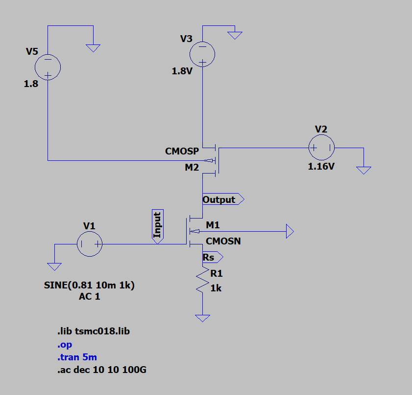
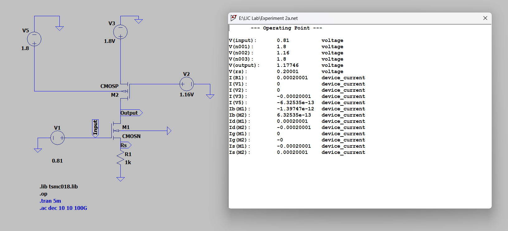
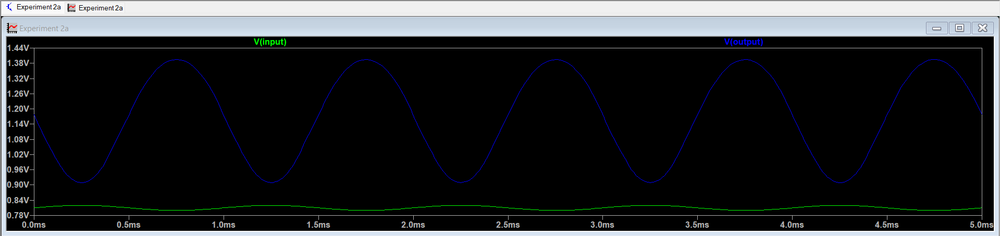

# Experiment 2A – CS Amplifier with Resistor Load

## Aim
To design a Common Source (CS) amplifier using an NMOS transistor with Source Degeneration and PMOS Active Load in 180nm TSMC technology in LTSpice with a supply voltage of 1.8V and power constraint less than or equal to 1mW, and to analyze its DC operating point, transient response, voltage gain, and bandwidth.

## 1. Introduction

A Common Source (CS) amplifier is one of the most fundamental single-stage MOSFET amplifier configurations used in analog circuit design. In this configuration, the input signal is applied at the gate terminal, the output is taken from the drain, and the source terminal acts as the common reference node.

In this experiment, the CS amplifier is implemented using:

- An NMOS transistor as the amplifying device  
- A PMOS transistor as an active load  
- A source resistor $R_S$ for source degeneration  

##

### PMOS Active Load

Instead of using a passive resistor as the drain load, a PMOS transistor is used as an active load. An active load provides a higher output resistance $r_o$ compared to a physical resistor, which increases the voltage gain of the amplifier.

Since voltage gain of a CS amplifier is approximately:

$$
A_v \approx - g_m R_{out}
$$

Increasing $R_{out}$ results in higher gain.

##

### Source Degeneration

The source resistor $R_S$ introduces negative feedback in the circuit. This technique is called **source degeneration**.

With source degeneration, the voltage gain becomes:

$$
A_v = \frac{g_m (r_{o1} || r_{o2})}{1 + g_m R_S}
$$

Effects of source degeneration:

- Improves linearity  
- Stabilizes the operating point  
- Reduces sensitivity to device variations  
- Increases input dynamic range  

However, the gain is reduced due to the term $(1 + g_m R_S)$ in the denominator.

##

### What the Circuit Does

The CS amplifier with source degeneration and PMOS active load:

- Amplifies small input voltage signals  
- Produces an inverted output signal (180° phase shift)  
- Operates with the transistor in saturation region  
- Provides improved bias stability and linear performance  

This configuration is widely used in analog integrated circuits where moderate gain, better linearity, and stable biasing are required.

---

## 2. Working Principle

The NMOS transistor $M_1$ operates in the saturation region and acts as the amplifying device. A small variation in the input voltage $v_{in}$ produces a change in gate-to-source voltage $V_{GS}$, which in turn changes the drain current according to:

$$
i_d = g_m v_{gs}
$$

This change in drain current flows through the PMOS active load, creating a voltage variation at the output node:

$$
v_{out} = - i_d R_{out}
$$

The negative sign indicates a 180° phase inversion between input and output.

The source resistor $R_S$ introduces negative feedback. As drain current increases, the source voltage rises, reducing $V_{GS}$ and stabilizing the operating point. This improves linearity but reduces the gain:

$$
A_v \approx \frac{-g_m r_o}{1 + g_m R_S}
$$

Thus, the circuit provides controlled voltage amplification with improved stability and linearity.

---

## Circuit Schematic

---

## 3. Design Calculations

### GIVEN PARAMETERS

- Technology: TSMC 180nm
- Supply voltage, $V_{DD} = 1.8V$
- Power constraint ≤ 1mW
- Channel length, $L_n = 560nm$
- Threshold voltage, $V_T ≈ 0.366V$
- Electron mobility, $\mu_n = 273.81 \times 10^{-4} \ m^2/Vs$
- Load capacitor, $C_L = 10pF$
- Gate oxide thickness, $t_ox = 4.1 \times 10^{-9} \ m$

### 3.1 Power Constraint

The total power consumed by the circuit is given by:

$$
P = V_{DD} I_D
$$

Since the maximum allowed power is 1mW,

$$
I_D \le \frac{1 \times 10^{-3}}{1.8}
$$

$$
I_D \le 555.5\mu A
$$

To stay safely within this limit and also maintain reasonable gain, I assumed:

$$
I_D = 200\mu A
$$  

Power dissipated:

$$
P = 1.8V × 200µA = 0.36mW
$$

Since 0.36mW < 1mW, power constraint is satisfied.

##

### 3.2 Bias Point Selection

Assume overdrive voltage:

$$
V_{OV} = 0.25V
$$

### NMOS Bias Voltage

From:

$$
V_{OV} = V_{GS} - V_T
$$

$$
V_{GS} = V_{OV} + V_T
$$

$$
V_{GS} = 0.25 + 0.36
$$

$$
V_{GS} = 0.61V
$$

##

### Gate Voltage

Applying KVL:

$$
V_G = V_{GS} + V_{RS}
$$

$$
V_G = 0.61 + 0.2
$$

$$
V_G = 0.81V
$$

##

### Source Degeneration Resistor

Assume source voltage drop:

$$
V_{RS} = 0.2V
$$

$$
V_{RS} = I_D R_S
$$

$$
0.2 = 200 \times 10^{-6} \times R_S
$$

$$
R_S = 1k\Omega
$$

##

### Output Bias Voltage

For near-symmetrical swing:

$$
V_{OUT} \approx \frac{V_{DD}}{2} + 0.2
$$

$$
V_{OUT} = \frac{1.8}{2} + 0.2
$$

$$
V_{OUT} = 1.1V
$$

##

### Saturation Condition

$$
V_{DS} \ge V_{GS} - V_T
$$

$$
V_{DS} \ge 0.25V
$$

Since actual $V_{DS} \approx 0.9V$, the NMOS transistor operates in saturation.

---

### PMOS Bias Voltage

For PMOS:

$$
V_{OVp} = V_{SG} - |V_{TP}|
$$

$$
0.25 = V_{SG} - 0.39
$$

$$
V_{SG} = 0.64V
$$

Since:

$$
V_{SG} = V_S - V_G
$$

$$
0.64 = 1.8 - V_G
$$

$$
V_G = 1.16V
$$

---

### 3.3 Width Calculation

Drain current in saturation:

$$
I_D = \frac{1}{2} \mu_n C_{ox} \frac{W}{L} (V_{OV})^2
$$

Rearranging:

$$
W = \frac{2 I_D L}{\mu_n C_{ox} (V_{OV})^2}
$$

### For NMOS

Initially, the calculated NMOS width came out to be approximately

$$
W_n = 15.15\mu m
$$

However, after running the simulation, the drain current was slightly lower than the intended 200µA. This happens because practical transistor models include second-order effects that slightly alter the expected current.

To correct this and achieve the desired operating current, I increased the width to:

$$
W_n = 56.815\mu m
$$

After this adjustment, the operating point matched the design target

##

### For PMOS:

Initially, the calculated PMOS width came out to be approximately

$$
W_p = 35.86\mu m
$$

However, after running the simulation, the drain current was slightly lower than the intended 200µA. This happens because practical transistor models include second-order effects that slightly alter the expected current.

To correct this and achieve the desired operating current, I increased the width to:

$$
W_p = 83\mu m
$$

After this adjustment, the operating point matched the design target

---

## DC Analysis

The DC operating point confirms that the output voltage is near the designed bias value, ensuring proper saturation operation.

---

### 3.4 Simulated & Theoretical Voltage Gain

### Transient Analysis

The output waveform is amplified and inverted, confirming proper CS operation.

### Simulated Gain

Input signal parameters:

- Type: Sine wave  
- Frequency = 1kHz  
- Amplitude = 10mV  
- DC Offset = 0.81V  

Measured peak-to-peak values:

$$
V_{in(p-p)} = 819.956mV - 800.212mV = 19.744mV
$$

$$
V_{out(p-p)} = 1.394V - 909.560mV = 0.4844V
$$

Voltage gain:

$$
A_v = \frac{V_{out(p-p)}}{V_{in(p-p)}}
$$

$$
A_v = \frac{0.4844}{19.744 \times 10^{-3}}
$$

$$
A_v = 24.534
$$

Gain in dB:

$$
A_v(dB) = 20\log_{10}(24.534)
$$

$$
A_v(dB) = 27.795dB
$$

##

### Theoretical Gain

Assume channel length modulation:

$$
\lambda = 0.1V^{-1}
$$

Transconductance:

$$
g_m = \frac{2I_D}{V_{OV}}
$$

$$
g_m = 1.6 \times 10^{-3} S
$$

Output resistance:

$$
r_o = \frac{1}{\lambda I_D}
$$

$$
r_o = 50k\Omega
$$

Effective output resistance:

$$
r_{o1} || r_{o2} = 25k\Omega
$$

Voltage gain with source degeneration:

$$
A_v = \frac{g_m (r_{o1} || r_{o2})}{1 + g_m R_S}
$$

$$
A_v = 15.38
$$

Gain in dB:

$$
A_v(dB) = 20\log_{10}(15.38)
$$

$$
A_v(dB) = 23.739dB
$$

---

### 3.5 AC Analysis

In AC analysis, the frequency response of the Common Source amplifier is observed.

The midband gain is obtained from the flat region of the Bode plot.  
The bandwidth is defined as the frequency range between the lower cutoff frequency ($f_L$) and upper cutoff frequency ($f_H$), measured at the −3 dB points.

##

### Midband Gain

From AC simulation:

$$
A_v = 27.917 \text{ dB}
$$

The −3 dB gain is:

$$
A_v - 3 = 27.917 - 3
$$

$$
A_v - 3 = 24.917 \text{ dB}
$$

##

### Cutoff Frequencies

Lower cutoff frequency:

$$
f_L = 0
$$

Upper cutoff frequency:

$$
f_H = 39.954 \text{ MHz}
$$

##

### Bandwidth Calculation

Bandwidth is defined as:

$$
BW = f_H - f_L
$$

$$
BW = 39.954 \text{ MHz} - 0
$$

$$
BW = 39.954 \text{ MHz}
$$

---

### 3.6 Unity Gain Bandwidth

$$
f_{0dB} = 1.516\,\text{GHz}
$$

$$
UGB = A_v \times f_H
$$

$$
UGB = 27.795 \times  39.954 \text{ MHz}
$$

$$
UGB = 1.11 \text{ GHz} \approx 1.516 \text{ GHz}
$$

---

### Note

First-order theoretical analysis assumes ideal saturation and neglects higher-order short-channel effects.

### Comparison of Results

| Parameter | Theoretical | Simulated |
|------------|-------------|-----------|
| Voltage Gain ($A_v$) | 15.38 V/V | 24.53 V/V |
| Gain (dB) | 23.74 dB | 27.79 dB |

---

## Inference

The Common Source (CS) amplifier with PMOS active load and source degeneration was successfully designed using 180nm TSMC technology while satisfying the given design constraints:

Power consumption ≤ 1mW  
VDD = 1.8V  
CL = 10pF  

The selected drain current of 200µA ensured that the total power dissipation remained within limits (0.36mW).

The bias point was carefully chosen to keep the NMOS transistor in saturation and to allow near-symmetrical output swing, ensuring proper linear amplification.

Theoretical and simulated results are reasonably consistent:

Theoretical gain ≈ 15.38 V/V (23.74 dB)  
Simulated transient gain ≈ 24.53 V/V (27.79 dB)  
Simulated midband gain (AC) ≈ 27.92 dB  
Simulated bandwidth ≈ 39.954 MHz  
Unity Gain Frequency ≈ 1.516 GHz  

The difference between theoretical and simulated results arises due to second-order effects such as channel length modulation, mobility degradation, and parasitic capacitances included in the practical MOSFET model.

From the AC analysis, it is observed that the load capacitance ($C_L$) introduces a dominant pole at the output node, limiting the high-frequency response and defining the bandwidth of the amplifier.

Source degeneration improves bias stability and linearity but reduces the overall gain compared to an ideal CS amplifier without degeneration.

Hence, the designed CS amplifier satisfies the required specifications and demonstrates correct biasing, expected gain behavior, and proper frequency response characteristics.
