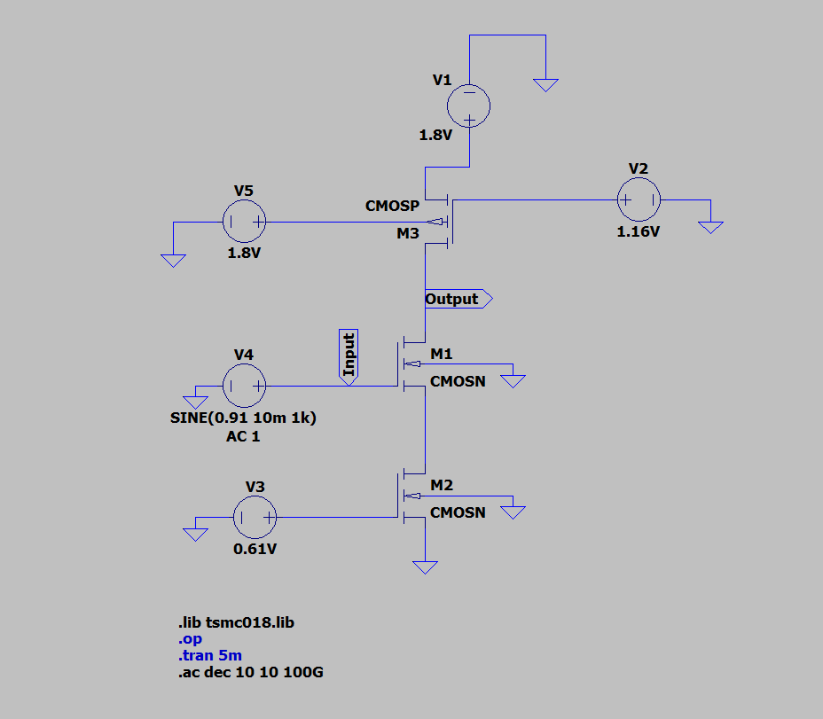
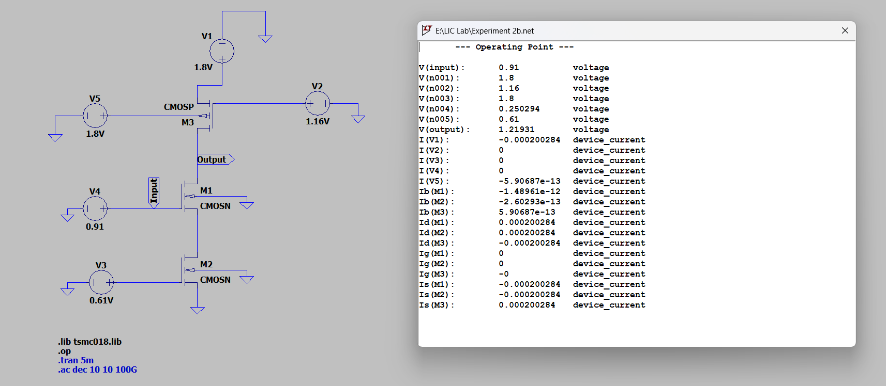
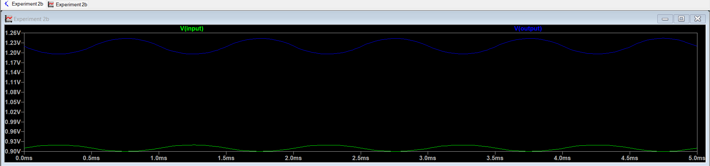
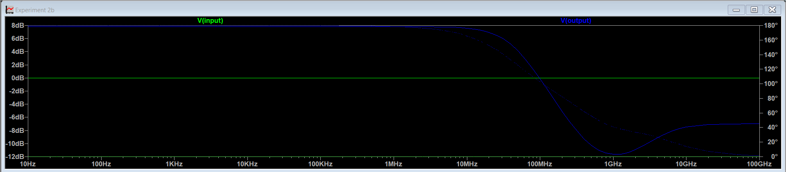

# Experiment 2B – CS Amplifier with PMOS Active Load and NMOS Current Source

##  Aim

To design a Common Source (CS) amplifier using an NMOS transistor with NMOS Current Source and PMOS Active Load in 180nm TSMC technology in LTSpice with a supply voltage of 1.8V and power constraint less than or equal to 1mW, and to analyze its DC operating point, transient response, voltage gain, and bandwidth

## Introduction

The Common Source (CS) amplifier is a fundamental MOSFET amplifier configuration widely used in analog integrated circuit design.

In this experiment, the CS amplifier is implemented using:

- NMOS transistor M1 as the amplifying device  
- PMOS transistor M2 as the active load  
- NMOS transistor M3 as the current source  

In this configuration, both the drain and source resistors are replaced by MOSFETs, making the circuit fully compatible with CMOS fabrication technology.

##

### PMOS Active Load (M2)

Instead of using a passive drain resistor, a PMOS transistor (M2) is used as an active load.

When biased in saturation, M2 provides a high small-signal output resistance:

$$
r_{o2} = \frac{1}{\lambda_p I_D}
$$

The approximate voltage gain of a CS amplifier is:

$$
A_v \approx -g_{m1} R_{out}
$$

where:

$$
R_{out} \approx r_{o2}
$$

Thus, increasing output resistance increases the voltage gain without requiring large physical resistors.

##

### NMOS Current Source (M3)

The source resistor is replaced by NMOS transistor M3, which is biased in saturation and acts as a current source.

M3 establishes the bias current of the amplifier and stabilizes the operating point. Its small-signal output resistance is:

$$
r_{o3} = \frac{1}{\lambda_n I_D}
$$

Since M3 is not an ideal current source, its finite output resistance affects the overall gain.

##

### Source Degeneration Effect Using M3

Because M3 has finite output resistance, it introduces a degeneration effect in the source of M1.

The effective voltage gain becomes:

$$
A_v = \frac{-g_{m1} r_{o2}}{1 + g_{m1} r_{o3}}
$$

The denominator term:

$$
(1 + g_{m1} r_{o3})
$$

reduces the overall gain and acts similarly to classical source degeneration.

##

### Effects of NMOS Current Source Degeneration

- Improves bias stability  
- Reduces sensitivity to device variations  
- Enhances linearity  
- Increases operating point robustness  

However, the voltage gain is reduced due to the additional term in the denominator.

##

### Overall Function of the Circuit

This amplifier:

- Amplifies small input voltage signals  
- Produces a 180° phase inversion between input and output  
- Uses MOSFET-based active elements instead of resistors  
- Provides improved bias control and integration compatibility  

Thus, this circuit demonstrates how transistor-based active loading and current source biasing influence gain, stability, and overall amplifier performance.

---

## 2. Working Principle

The NMOS transistor M1 operates in the saturation region and acts as the amplifying device. A small variation in the input voltage $v_{in}$ produces a change in gate-to-source voltage $v_{gs1}$, which changes the drain current according to:

$$
i_d = g_{m1} v_{gs1}
$$

This varying drain current flows through the PMOS active load M2, producing a voltage variation at the output:

$$
v_{out} = - i_d r_{o2}
$$

The negative sign indicates a 180° phase inversion between input and output.

Since the source of M1 is connected to M3 (which has finite output resistance $r_{o3}$), the effective voltage gain becomes:

$$
A_v = \frac{-g_{m1} r_{o2}}{1 + g_{m1} r_{o3}}
$$

The denominator term:

$$
(1 + g_{m1} r_{o3})
$$

represents the degeneration effect introduced by the current source transistor.

---

## Circuit Schematic

---

## 3. Design Calculations

### GIVEN PARAMETERS

- Technology: TSMC 180nm
- Supply voltage, $V_{DD} = 1.8V$
- Power constraint ≤ 1mW
- Channel length, $L_n = 560nm$
- Threshold voltage, $V_T ≈ 0.366V$
- Electron mobility, $\mu_n = 273.81 \times 10^{-4} \ m^2/Vs$
- Load capacitor, $C_L = 10pF$
- Gate oxide thickness, $t_ox = 4.1 \times 10^{-9} \ m$

### 3.1 Power Constraint

The total power consumed by the circuit is given by:

$$
P = V_{DD} I_D
$$

Since the maximum allowed power is 1mW,

$$
I_D \le \frac{1 \times 10^{-3}}{1.8}
$$

$$
I_D \le 555.5\mu A
$$

To stay safely within this limit and also maintain reasonable gain, I assumed:

$$
I_D = 200\mu A
$$  

Power dissipated:

$$
P = 1.8V × 200µA = 0.36mW
$$

Since 0.36mW < 1mW, power constraint is satisfied.

---

## 3.2 Bias Point Selection

To ensure proper amplification, all transistors must operate in the saturation region.

### NMOS M1 Bias:

Assume overdrive voltage:

$$
V_{OV} = 0.25V
$$

For NMOS:

$$
V_{GS1} = V_{OV} + V_{TN}
$$

$$
V_{GS1} = 0.25 + 0.36
$$

$$
V_{GS1} = 0.61V
$$

Assume source voltage:

$$
V_{S1} = 0.3V
$$

Then gate voltage becomes:

$$
V_G = V_{GS1} + V_{S1}
$$

$$
V_G = 0.61 + 0.3
$$

$$
V_G = 0.91V
$$

---

### Output Voltage Selection

For near-symmetrical output swing:

$$
V_{OUT} \approx \frac{V_{DD}}{2} + V_{S1}
$$

$$
V_{OUT} = 0.9 + 0.3
$$

$$
V_{OUT} = 1.2V
$$

Drain-to-source voltage:

$$
V_{DS1} = V_{OUT} - V_{S1}
$$

$$
V_{DS1} = 1.2 - 0.3
$$

$$
V_{DS1} = 0.9V
$$

Since:

$$
V_{DS1} > V_{OV}
$$

M1 operates in saturation.

##

### NMOS M3 (Current Source) Bias:

For M3:

$$
V_{GS3} = V_{OV} + V_{TN}
$$

$$
V_{GS3} = 0.61V
$$

Since its source is grounded:

$$
V_{G3} = 0.61V
$$

Check saturation:

$$
V_{DS3} = V_{S1} = 0.3V
$$

Since:

$$
V_{DS3} > V_{OV}
$$

M3 operates in saturation.

---

### PMOS M2 Bias:

For PMOS:

$$
V_{SG2} = V_{OV} + |V_{TP}|
$$

$$
V_{SG2} = 0.25 + 0.39
$$

$$
V_{SG2} = 0.64V
$$

Drain-to-source voltage:

$$
V_{SD2} = V_{DD} - V_{OUT}
$$

$$
V_{SD2} = 1.8 - 1.2
$$

$$
V_{SD2} = 0.6V
$$

Since:

$$
V_{SD2} > V_{OV}
$$

M2 also operates in saturation.

Thus, all three transistors are properly biased in the saturation region, ensuring correct amplifier operation.

---

## 3.3 Width Calculation

The drain current in saturation is given by:

$$
I_D = \frac{1}{2} \mu C_{ox} \frac{W}{L} (V_{OV})^2
$$

Rearranging to find the width:

$$
W = \frac{2 I_D L}{\mu C_{ox} (V_{OV})^2}
$$

Given:

- $I_D = 200\mu A$
- $L = 560nm$
- $V_{OV} = 0.25V$

---

### NMOS (M1 and M3)

For NMOS:

$$
W_n = \frac{2 I_D L}{\mu_n C_{ox} (V_{OV})^2}
$$

Substituting values:

$$
W_n = \frac{2 \times 200 \times 10^{-6} \times 560 \times 10^{-9}}
{2.365 \times 10^{-4} \times (0.25)^2}
$$

$$
W_n \approx 15.15\mu m
$$

After simulation tuning to obtain the desired drain current:

- $W_{M1} = 34.845\mu m$
- $W_{M3} = 31.5\mu m$

---

### PMOS (M2)

For PMOS:

$$
W_p = \frac{2 I_D L}{\mu_p C_{ox} (V_{OV})^2}
$$

Substituting values:

$$
W_p = \frac{2 \times 200 \times 10^{-6} \times 560 \times 10^{-9}}
{9.98 \times 10^{-5} \times (0.25)^2}
$$

$$
W_p \approx 35.86\mu m
$$

After tuning:

- $W_{M2} = 83.478\mu m$

##

Thus, the transistor widths were adjusted to achieve the desired operating current while maintaining proper saturation conditions.

---

## DC Analysis

The DC operating point confirms that the output voltage is near the designed bias value, ensuring proper saturation operation.

---

### 3.4 Theoretical & Simulated Voltage Gain

### Transient Analysis

The output waveform is amplified and inverted, confirming proper CS operation.

### Simulated Gain

The input signal applied was:

- Type: Sine wave  
- Frequency = 1kHz  
- Amplitude = 10mV  
- DC Offset = 0.91V  

Measured peak-to-peak values:

$$
V_{in(p-p)} = 919.557mV - 900.460mV = 19.125mV
$$

$$
V_{out(p-p)} = 1.243V - 1.96V = 0.047V
$$

Voltage gain is calculated as:

$$
A_v = \frac{V_{out(p-p)}}{V_{in(p-p)}}
$$

$$
A_v = \frac{0.047}{19.125 \times 10^{-3}}
$$

$$
A_v = 2.45
$$

Gain in dB:

$$
A_v(dB) = 20 \log_{10}(A_v)
$$

$$
A_v(dB) = 20 \log_{10}(2.45)
$$

$$
A_v(dB) = 7.78 \text{ dB}
$$

---

### Theoretical Gain

For the Common Source amplifier with NMOS current source and PMOS active load, the small-signal voltage gain is given by:

$$
A_v = \frac{-g_{m1} r_{o2}}{1 + g_{m1} r_{o3}}
$$

This expression is obtained by assuming:

- $\lambda_1 = 0$ (output resistance of M1 neglected)
- All transistors operating in saturation

##

### Transconductance of M1

$$
g_{m1} = \frac{2 I_D}{V_{OV}}
$$

$$
g_{m1} = \frac{2 \times 200 \times 10^{-6}}{0.25}
$$

$$
g_{m1} = 1.6 \times 10^{-3} \ S
$$

##

### Output Resistances

$$
r_o = \frac{1}{\lambda I_D}
$$

For $\lambda = 0.1 \ V^{-1}$:

$$
r_{o2} = r_{o3} = \frac{1}{0.1 \times 200 \times 10^{-6}}
$$

$$
r_{o2} = r_{o3} = 50k\Omega
$$

##

### Gain Calculation

$$
A_v = \frac{-(1.6 \times 10^{-3}) \times 50 \times 10^3}
{1 + (1.6 \times 10^{-3}) \times 50 \times 10^3}
$$

$$
A_v = \frac{-80}{1 + 80}
$$

$$
A_v = \frac{-80}{81}
$$

$$
A_v \approx -0.99
$$

Magnitude:

$$
|A_v| \approx 0.99
$$

Gain in dB:

$$
A_v(dB) = 20 \log_{10}(0.99)
$$

$$
A_v(dB) \approx -0.08 \text{ dB}
$$

Thus, when $g_{m1} r_{o3}$ is large, the denominator significantly reduces the gain, explaining why Experiment B produces lower gain compared to Experiment A.

### 3.5 Reason for Difference Between Theoretical and Simulated Gain

The theoretical gain of the amplifier was calculated using first-order small-signal equations under ideal assumptions. However, the simulated gain differs due to several practical non-ideal effects included in the MOSFET model.

##

### 1. Channel Length Modulation

The theoretical expression assumes a fixed value of channel length modulation parameter $\lambda$.  
In practice, $\lambda$ varies with bias voltage and device dimensions.

Since:

$$
r_o = \frac{1}{\lambda I_D}
$$

any variation in $\lambda$ directly affects output resistance and hence the gain.

##

### 2. Finite Output Resistance of All Transistors

In simplified analysis, some output resistances (such as $r_{o1}$) may be neglected.  
In simulation, all transistors have finite output resistance, which alters:

$$
R_{out}
$$

This changes the effective gain from the ideal calculated value.

##

### 3. Mobility Degradation and Velocity Saturation

The theoretical transconductance is calculated as:

$$
g_m = \frac{2 I_D}{V_{OV}}
$$

However, in practical models, mobility reduces at higher electric fields.  
This lowers the actual $g_m$, thereby reducing the gain.

##

### 4. Degeneration Due to Current Source (M3)

The gain expression for this circuit is:

$$
A_v = \frac{-g_{m1} r_{o2}}{1 + g_{m1} r_{o3}}
$$

Any mismatch between calculated and simulated values of $g_{m1}$ and $r_{o3}$ significantly affects the denominator term, causing deviation in gain.

##

### 5. Parasitic Capacitances

The simulation model includes parasitic capacitances such as:

- $C_{gs}$
- $C_{gd}$
- $C_{db}$

These are neglected in first-order theoretical analysis but influence the AC response and measured gain.

##

### Conclusion

The difference between theoretical and simulated gain arises due to:

- Second-order MOSFET effects  
- Non-ideal output resistances  
- Practical device modeling  
- Degeneration introduced by the current source transistor  

Therefore, a small deviation between calculated and simulated gain is expected and acceptable.

---

### 3.6 AC Analysis

In AC analysis, the frequency response of the Common Source amplifier is observed.

The midband gain is obtained from the flat region of the Bode plot.  
The bandwidth is defined as the frequency range between the lower cutoff frequency ($f_L$) and upper cutoff frequency ($f_H$), measured at the −3 dB points.

##

### Midband gain:

From AC simulation:

$$
A_v = 7.816 \text{ dB}
$$

The −3 dB gain is:

$$
A_v - 3 = 7.816 - 3
$$

$$
A_v - 3 = 4.816 \text{ dB}
$$

##

### Cutoff Frequencies

Lower cutoff frequency:

$$
f_L = 0
$$

Upper cutoff frequency:

$$
f_H = 42.59 \text{ MHz}
$$

##

### Bandwidth

Bandwidth is defined as:

$$
BW = f_H - f_L
$$

$$
BW = 42.59 - 0
$$

$$
BW = 42.59 \text{ MHz}
$$

The high-frequency roll-off is mainly due to parasitic capacitances and the load capacitance at the output node.

---

### 3.7 Unity Gain Bandwidth (UGB)

$$
f_{0dB} \approx 9803\,\text{MHz}
$$

$$
UGB = A_v \times f_H
$$

Using linear gain:

$$
A_v = 2.45
$$

$$
UGB = 2.45 \times 42.59 \text{ MHz}
$$

$$
UGB = 104.35 \text{ MHz}
$$

---

### Note

The unity gain bandwidth is lower compared to Experiment A because the degeneration introduced by the NMOS current source reduces the overall voltage gain. 

First-order theoretical analysis assumes ideal saturation and neglects higher-order effects such as channel length modulation, mobility degradation, and parasitic capacitances present in practical MOSFET models.

## Comparison of Results

| Parameter | Theoretical | Simulated |
|------------|-------------|-----------|
| Voltage Gain ($A_v$) | 0.99 V/V | 2.45 V/V |
| Gain (dB) | -0.08 dB | 7.78 dB |

The deviation between theoretical and simulated gain is mainly due to simplified first-order assumptions used in analytical calculations and the inclusion of non-ideal MOSFET effects in simulation.

## Inference

The Common Source (CS) amplifier with PMOS active load and NMOS current source was successfully designed using 180nm TSMC technology while satisfying the given design constraints:

Power consumption ≤ 1mW  
VDD = 1.8V  
CL = 10pF  

The chosen drain current of 200µA ensured that the total power dissipation remained within limits (0.36mW).

The bias point was selected such that all three transistors (M1, M2, and M3) operate in the saturation region, ensuring proper small-signal amplification and stable DC operation.

The theoretical and simulated results are as follows:

Theoretical gain ≈ 0.99 V/V (≈ -0.08 dB)  
Simulated transient gain ≈ 2.45 V/V (7.78 dB)  
Simulated midband gain (AC) ≈ 7.816 dB  
Simulated bandwidth ≈ 42.59 MHz  
Unity Gain Frequency ≈ 104.35 MHz  

A noticeable deviation exists between theoretical and simulated gain values. This deviation arises due to:

- Simplified first-order assumptions in theoretical analysis  
- Neglecting some output resistances in derivation  
- Variation in channel length modulation parameter (λ)  
- Mobility degradation and short-channel effects  
- Accurate parasitic modeling in the simulator  

The gain expression:

$$
A_v = \frac{-g_{m1} r_{o2}}{1 + g_{m1} r_{o3}}
$$

shows that the finite output resistance of the current source transistor (M3) significantly reduces the gain through the denominator term. Any variation in $r_{o3}$ directly affects the gain, explaining the difference between analytical and simulated results.

From the AC analysis, the load capacitance ($C_L$) and intrinsic parasitic capacitances introduce a dominant pole at the output node, limiting the high-frequency response and defining the bandwidth.

Thus, Experiment B demonstrates how replacing the source resistor with a transistor current source improves bias stability but introduces additional degeneration, resulting in reduced gain compared to Experiment A.
