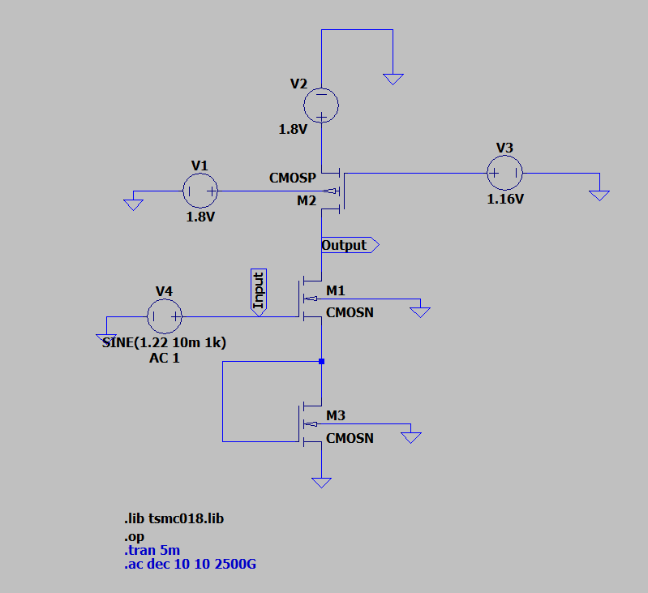
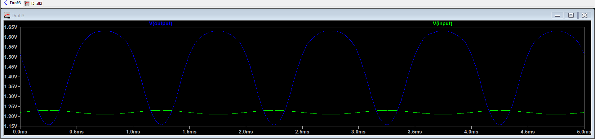
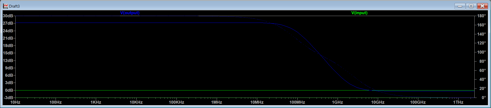

# Experiment 2C - Common Source (CS) Amplifier using PMOS Active Load and Diode-Connected NMOS

## Aim
To design a Common Source (CS) amplifier using an NMOS transistor with PMOS Active Load and Diode-Connected NMOS in 180nm TSMC technology in LTSpice with a supply voltage of 1.8V and power constraint less than or equal to 1mW, and to analyze its DC operating point, transient response, voltage gain, and bandwidth.

## 1. Introduction

A Common Source (CS) amplifier is one of the most fundamental single-stage MOSFET amplifier configurations used in analog circuit design. In this configuration, the input signal is applied at the gate terminal, the output is taken from the drain, and the source terminal serves as the common reference node.

In this experiment, the CS amplifier is implemented using:

- An NMOS transistor (M1) as the amplifying device  
- A PMOS transistor (M2) as an active load  
- A diode-connected NMOS transistor (M3) at the source  

##

### PMOS Active Load

Instead of using a passive resistor as the drain load, a PMOS transistor is used as an active load. When biased in saturation, it provides a high small-signal output resistance $r_{o2}$ compared to a physical resistor.

Since the voltage gain of a CS amplifier is approximately:

$$
A_v \approx - g_{m1} R_{out}
$$

where:

$$
R_{out} \approx r_{o1} || r_{o2}
$$

Increasing $R_{out}$ results in higher voltage gain without requiring large integrated resistors.

##

### Diode-Connected NMOS (M3)

In this experiment, the source terminal of M1 is connected to a diode-connected NMOS transistor (M3). A diode-connected MOSFET has its gate and drain shorted together.

Its small-signal resistance is:

$$
r_{d3} = \frac{1}{g_{m3} + g_{ds3}}
$$

This configuration provides:

- Self-biasing of the amplifier  
- Improved operating point stability  
- Transistor-based current control  

However, it introduces source degeneration because the source is no longer at AC ground.

##

### Source Degeneration Effect

Due to the finite small-signal resistance of M3, the voltage gain becomes:

$$
A_v = \frac{-g_{m1} (r_{o1} || r_{o2})}{1 + g_{m1} r_{d3}}
$$

The denominator term:

$$
(1 + g_{m1} r_{d3})
$$

represents the degeneration introduced by the diode-connected transistor.

Effects of this degeneration:

- Improves bias stability  
- Enhances linearity  
- Reduces sensitivity to device variations  

However, the overall voltage gain is reduced compared to an ideal CS amplifier without degeneration.

##

### What the Circuit Does

The CS amplifier with PMOS active load and diode-connected NMOS:

- Amplifies small input voltage signals  
- Produces an inverted output signal (180° phase shift)  
- Operates with all transistors in saturation  
- Provides stable self-biasing using transistor-based degeneration  
- Achieves higher gain than Experiment B but lower than an ideal CS stage  

This configuration is commonly used in analog integrated circuits where controlled gain, improved stability, and compact CMOS implementation are required.

---

## 2. Working Principle

The NMOS transistor **M1** operates in saturation and acts as the amplifying device.

A small change in input voltage $v_{in}$ changes the gate-to-source voltage:

$$
i_d = g_{m1} v_{gs1}
$$

This drain current flows through the PMOS active load M2 and produces an output voltage variation:

$$
v_{out} = - i_d R_{out}
$$

where:

$$
R_{out} \approx r_{o1} \parallel r_{o2}
$$

The negative sign indicates a 180° phase inversion.

Since M3 is diode-connected, its small-signal resistance is:

$$
r_{d3} = \frac{1}{g_{m3} + g_{ds3}}
$$

This introduces source degeneration and reduces gain compared to an ideal CS amplifier.

---

## Circuit Schematic

---

## 3. Design Calculations

### GIVEN PARAMETERS

- Technology: TSMC 180nm
- Supply voltage, $V_{DD} = 1.8V$
- Power constraint ≤ 1mW
- Channel length, $L_n = 560nm$
- Threshold voltage, $V_T ≈ 0.366V$
- Electron mobility, $\mu_n = 273.81 \times 10^{-4} \ m^2/Vs$
- Load capacitor, $C_L = 10pF$
- Gate oxide thickness, $t_ox = 4.1 \times 10^{-9} \ m$

### 3.1 Power Constraint

The total power consumed by the circuit is given by:

$$
P = V_{DD} I_D
$$

Since the maximum allowed power is 1mW,

$$
I_D \le \frac{1 \times 10^{-3}}{1.8}
$$

$$
I_D \le 555.5\mu A
$$

To stay safely within this limit and also maintain reasonable gain, I assumed:

$$
I_D = 200\mu A
$$  

Power dissipated:

$$
P = 1.8V × 200µA = 0.36mW
$$

Since 0.36mW < 1mW, power constraint is satisfied.

##

### 3.2 Bias Point Selection

Assume overdrive voltage:

$$
V_{OV} = 0.25V
$$

### NMOS M1 Bias:

For M1:

$$
V_{GS1} = V_{OV} + V_{TN}
$$

$$
V_{GS1} = 0.25 + 0.366
$$

$$
V_{GS1} = 0.61V
$$

Since M3 is diode-connected,

$$
V_{S1} = V_{GS3}
$$

$$
V_{S1} = 0.61V
$$

Gate voltage becomes:

$$
V_{IN} = V_{GS1} + V_{S1}
$$

$$
V_{IN} = 0.61 + 0.61
$$

$$
V_{IN} = 1.22V
$$

##

### Output Voltage Selection

For this configuration:

$$
V_{OUT} = \frac{V_{DD}}{2} + V_{DS3}
$$

$$
V_{OUT} = 0.9 + 0.61
$$

$$
V_{OUT} = 1.51V
$$

Drain-to-source voltage of M1:

$$
V_{DS1} = V_{OUT} - V_{S1}
$$

$$
V_{DS1} = 1.51 - 0.61
$$

$$
V_{DS1} = 0.90V
$$

Since:

$$
V_{DS1} > V_{OV}
$$

M1 operates in saturation.

---

### NMOS M3 (Diode-Connected) Bias:

For M3:

$$
V_{GS3} = V_{OV} + V_{TN}
$$

$$
V_{GS3} = 0.61V
$$

Since M3 is diode-connected:

$$
V_{DS3} = V_{GS3}
$$

$$
V_{DS3} = 0.61V
$$

Since:

$$
V_{DS3} > V_{OV}
$$

M3 operates in saturation.

---

### PMOS M2 Bias:

For PMOS M2:

$$
V_{SG2} = V_{OV} + |V_{TP}|
$$

$$
V_{SG2} = 0.25 + 0.39
$$

$$
V_{SG2} = 0.64V
$$

Drain-to-source voltage:

$$
V_{SD2} = V_{DD} - V_{OUT}
$$

$$
V_{SD2} = 1.8 - 1.51
$$

$$
V_{SD2} = 0.29V
$$

Since:

$$
V_{SD2} > V_{OV}
$$

M2 operates in saturation.

Thus, all three transistors operate in the saturation region, ensuring correct amplifier operation.

---

## 3.3 Width Calculation

The drain current in saturation is given by:

$$
I_D = \frac{1}{2} \mu C_{ox} \frac{W}{L} (V_{OV})^2
$$

Rearranging to calculate width:

$$
W = \frac{2 I_D L}{\mu C_{ox} (V_{OV})^2}
$$

Given:

- $I_D = 200\mu A$
- $L = 560nm$
- $V_{OV} = 0.25V$

---

### NMOS M1 Width

For NMOS:

$$
W_{M1} =
\frac{2 \times 200 \times 10^{-6} \times 560 \times 10^{-9}}
{2.365 \times 10^{-4} \times (0.25)^2}
$$

$$
W_{M1} \approx 15.15\mu m
$$

After tuning in simulation to obtain exact $I_D = 200\mu A$:

$$
W_{M1} = 73.5\mu m
$$

---

### NMOS M3 Width

Since M3 also carries the same current:

$$
W_{M3} \approx 15.15\mu m
$$

After tuning:

$$
W_{M3} = 78.5\mu m
$$

---

### PMOS M2 Width

For PMOS:

$$
W_{M2} =
\frac{2 \times 200 \times 10^{-6} \times 560 \times 10^{-9}}
{9.98 \times 10^{-5} \times (0.25)^2}
$$

$$
W_{M2} \approx 35.86\mu m
$$

After tuning:

$$
W_{M2} = 87.4\mu m
$$

##

Thus, transistor widths were adjusted to achieve the required drain current while maintaining proper saturation conditions.

---

## DC Analysis

The DC operating point confirms that the output voltage is near the designed bias value, ensuring proper saturation operation.

---

### 3.4 Theoretical & Simulated Voltage Gain

### Transient Analysis

The output waveform is amplified and inverted, confirming proper CS operation.

### Theoretical Gain

For this configuration (PMOS active load with diode-connected NMOS), the voltage gain is given by:

$$
A_v = \frac{-g_{m1} r_{o2}}{1 + \frac{g_{m1}}{g_{m3}}}
$$

### Transconductance:

$$
g_{m1} = \frac{2 I_D}{V_{OV}}
$$

$$
g_{m1} = \frac{2 \times 200 \times 10^{-6}}{0.25}
$$

$$
g_{m1} = 1.6 \times 10^{-3} \ S
$$

Since M3 carries the same current:

$$
g_{m3} = 1.6 \times 10^{-3} \ S
$$

Assuming channel length modulation:

$$
r_{o2} = \frac{1}{\lambda I_D}
$$

$$
r_{o2} = \frac{1}{0.1 \times 200 \times 10^{-6}}
$$

$$
r_{o2} = 50k\Omega
$$

Substituting:

$$
A_v = \frac{1.6 \times 10^{-3} \times 50 \times 10^{3}}
{1 + \frac{1.6 \times 10^{-3}}{1.6 \times 10^{-3}}}
$$

$$
A_v = \frac{80}{2}
$$

$$
A_v = 40
$$

Gain in dB:

$$
A_v(dB) = 20 \log_{10}(40)
$$

$$
A_v(dB) = 32.04\ dB
$$

---

### Simulated Gain (Transient Analysis)

Measured peak-to-peak values:

$$
V_{in(p-p)} = 1.229V - 1.210V =  0.019\ V
$$

$$
V_{out(p-p)} = 1.631V - 1.155V = 0.476\ V
$$

Voltage gain:

$$
A_v = \frac{V_{out(p-p)}}{V_{in(p-p)}}
$$

$$
A_v = \frac{0.476}{0.019}
$$

$$
A_v = 25.05
$$

Gain in dB:

$$
A_v(dB) = 20 \log_{10}(25.05)
$$

$$
A_v(dB) = 27.97\ dB
$$

---

## 3.5 Reasons for Difference Between Theoretical and Simulated Gain

The theoretical gain was calculated using a simplified small-signal expression:

$$
A_v = \frac{-g_{m1} r_{o2}}{1 + \frac{g_{m1}}{g_{m3}}}
$$

This expression assumes ideal device behavior and neglects several second-order effects. The deviation between the theoretical gain (40 V/V) and the simulated gain (~25 V/V) arises due to the following reasons:

##

### 1. Finite Output Resistance of M1

In the simplified derivation, the output resistance of M1 ($r_{o1}$) is often neglected.

In practice:

$$
R_{out} = r_{o1} \parallel r_{o2}
$$

This reduces the effective output resistance and therefore reduces the gain.

##

### 2. Non-Ideal Diode-Connected Transistor (M3)

The diode-connected NMOS (M3) does not behave as an ideal element. Its small-signal resistance is:

$$
r_{d3} = \frac{1}{g_{m3} + g_{ds3}}
$$

The presence of $g_{ds3}$ increases the effective degeneration, reducing the overall gain compared to the ideal expression.

##

### 3. Channel Length Modulation

The theoretical gain assumes a fixed channel length modulation parameter ($\lambda$). However, in simulation:

$$
r_o = \frac{1}{\lambda I_D}
$$

Since $\lambda$ varies with bias conditions, the effective output resistance differs from the assumed value, affecting gain.

##

### 4. Mobility Degradation and Short-Channel Effects

In modern 180nm technology, carrier mobility decreases at higher electric fields. This reduces the effective transconductance:

$$
g_m = \frac{2 I_D}{V_{OV}}
$$

As a result, the practical gain becomes lower than the theoretical value.

##

### 5. Parasitic Capacitances

The simulator includes intrinsic parasitic capacitances such as:

- $C_{gs}$
- $C_{gd}$
- $C_{db}$

These parasitics influence the small-signal response and slightly reduce the measured gain.

---

## Conclusion

The theoretical expression provides a first-order approximation.  
However, practical device non-idealities and second-order effects reduce the gain from the calculated 40 V/V to approximately 25 V/V in simulation.

Such deviation is expected and confirms the realistic behavior of MOSFET-based amplifier circuits.

### 3.6 AC Analysis

In AC analysis, the frequency response of the Common Source amplifier is observed.

The midband gain is obtained from the flat region of the Bode plot.  
The bandwidth is defined as the frequency range between the lower cutoff frequency ($f_L$) and upper cutoff frequency ($f_H$), measured at the −3 dB points.

##

### Midband Gain:

From AC simulation:

$$
A_v = 27.27 \text{ dB}
$$

The −3 dB gain is:

$$
A_v - 3 = 27.27 - 3
$$

$$
A_v - 3 = 24.27 \text{ dB}
$$

---

### Cutoff Frequencies

Lower cutoff frequency:

$$
f_L = 0
$$

Upper cutoff frequency:

$$
f_H = 83.21 \text{ MHz}
$$

---

### Bandwidth

Bandwidth is defined as:

$$
BW = f_H - f_L
$$

$$
BW = 83.21 - 0
$$

$$
BW = 83.21 \text{ MHz}
$$

The high-frequency roll-off is mainly due to the load capacitance ($C_L = 10pF$) and intrinsic parasitic capacitances of the MOSFETs.

---

### 3.7 Unity Gain Bandwidth (UGB)

From AC plot:

$$
f_{0dB} \approx 6.49\ \text{GHz}
$$

Using linear gain from transient analysis:

$$
A_v = 25.05
$$

$$
UGB = A_v \times f_H
$$

$$
UGB = 25.05 \times 83.21 \text{ MHz}
$$

$$
UGB = 2.08 \text{ GHz}
$$

---

### Note

The unity gain bandwidth is higher than Experiment B due to the increased midband gain achieved in this configuration.

First-order theoretical analysis assumes ideal saturation and neglects higher-order effects such as channel length modulation, finite output resistance, mobility degradation, and parasitic capacitances present in practical MOSFET models.

## Comparison of Results

| Parameter | Theoretical | Simulated |
|------------|-------------|-----------|
| Voltage Gain ($A_v$) | 0.99 V/V | 2.45 V/V |
| Gain (dB) | -0.08 dB | 7.78 dB |

The deviation between theoretical and simulated gain is mainly due to simplified first-order assumptions used in analytical calculations and the inclusion of non-ideal MOSFET effects in simulation.

## Inference

The Common Source (CS) amplifier with PMOS active load and diode-connected NMOS was successfully designed using 180nm TSMC technology while satisfying the given design constraints:

Power consumption ≤ 1mW  
VDD = 1.8V  
CL = 10pF  

The chosen drain current of 200µA ensured that the total power dissipation remained within limits (0.36mW).

The bias point was selected such that all three transistors (M1, M2, and M3) operate in the saturation region, ensuring proper small-signal amplification and stable DC operation.

The theoretical and simulated results are as follows:

Theoretical gain ≈ 40 V/V (32.04 dB)  
Simulated transient gain ≈ 25.05 V/V (27.97 dB)  
Simulated midband gain (AC) ≈ 27.27 dB  
Simulated bandwidth ≈ 83.21 MHz  
Unity Gain Bandwidth ≈ 2.08 GHz  

A noticeable deviation exists between theoretical and simulated gain values. This deviation arises due to:

- Simplified first-order assumptions in theoretical analysis  
- Neglecting finite output resistance of M1  
- Non-ideal small-signal behavior of the diode-connected transistor (M3)  
- Variation in channel length modulation parameter (λ)  
- Mobility degradation and short-channel effects  
- Accurate parasitic capacitance modeling in the simulator  

The gain expression:

$$
A_v = \frac{-g_{m1} r_{o2}}{1 + \frac{g_{m1}}{g_{m3}}}
$$

shows that the diode-connected transistor introduces source degeneration. In practical simulation, the effective small-signal resistance of M3 and the finite output resistance of M1 reduce the overall gain compared to the ideal theoretical prediction.

From the AC analysis, the intrinsic parasitic capacitances introduce a dominant pole at the output node, limiting the high-frequency response and defining the bandwidth.

Thus, Experiment C demonstrates that replacing the current source with a diode-connected NMOS increases gain compared to Experiment B due to reduced degeneration, while still maintaining proper biasing and satisfying the given power constraints.
