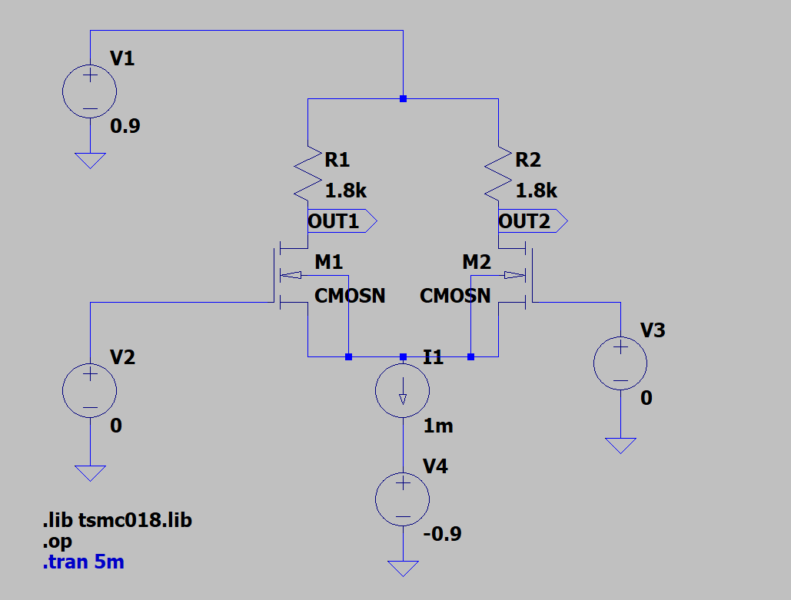
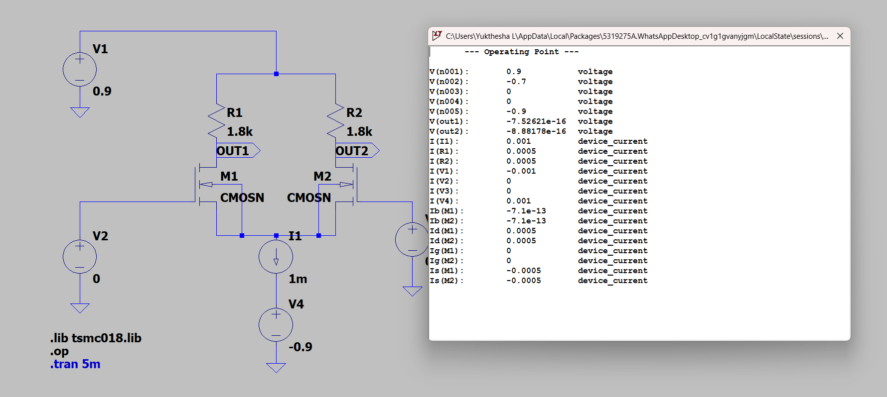
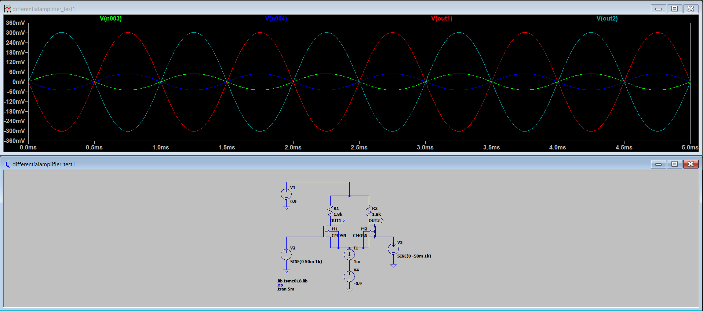
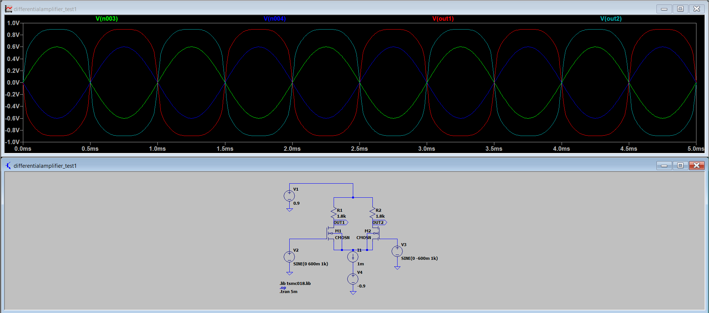
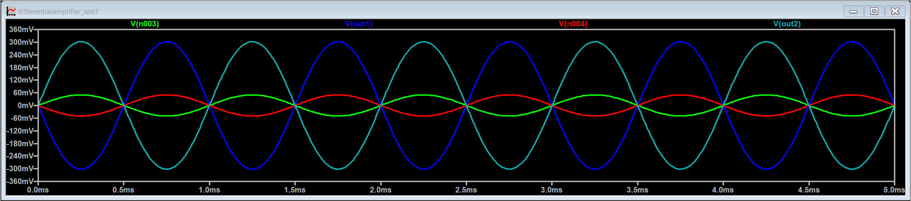

# Experiment 4 

# Differential Amplifier Analysis

## Aim

To design and simulate three MOSFET differential amplifier configurations using LTspice by performing DC, Transient, and AC analyses, and to compare their performance based on gain, bandwidth, and power efficiency.

## Introduction

A differential amplifier is one of the most fundamental building blocks in analog circuit design. It amplifies the difference between two input signals while rejecting common-mode signals, making it highly useful in noise-sensitive applications.

MOSFET-based differential amplifiers are widely used in integrated circuits such as operational amplifiers, comparators, and analog signal processing systems due to their high gain, good noise immunity, and efficient performance.

In this experiment, three different MOSFET differential amplifier configurations are analyzed using LTspice. The behavior of each circuit is studied through DC, Transient, and AC analyses to understand their gain, bandwidth, and overall performance characteristics.

## Theory

A differential amplifier is a circuit that amplifies the difference between two input signals while rejecting any signal that is common to both inputs. This property is known as common-mode rejection and is an important feature in analog circuit design.

A basic MOS differential amplifier consists of two matched MOSFETs (M1 and M2) whose sources are connected together and biased using a constant current source. The drains are connected to load elements such as resistors or active loads.

When a differential input voltage is applied:

$$
v_{id} = v_{in1} - v_{in2}
$$

the total current is steered between the two transistors depending on the input difference. If $v_{in1} > v_{in2}$, transistor M1 conducts more current, and if $v_{in2} > v_{in1}$, transistor M2 conducts more.

For small differential inputs, both transistors operate in the saturation region, and the circuit behaves linearly. The differential gain of the amplifier is given by:

$$
A_v = g_m R_{out}
$$

where $g_m$ is the transconductance of the MOSFET and $R_{out}$ is the effective output resistance.

The transconductance is defined as:

$$
g_m = \frac{2 I_D}{V_{ov}}
$$

where $I_D$ is the drain current and $V_{ov}$ is the overdrive voltage.

For larger differential inputs:

$$
v_{id} > \sqrt{2} V_{ov}
$$

one transistor turns OFF while the other carries the entire current, resulting in non-linear operation.

The performance of the differential amplifier depends on the type of load used:

- Resistive load → moderate gain  
- Active load → higher output resistance and higher gain  
- Current mirror load → maximum gain and improved output characteristics  

Thus, by changing the circuit configuration, the gain, bandwidth, and overall performance of the differential amplifier can be significantly affected.

---

## Circuit 1: Differential Amplifier with Resistive Load

## 1.1 Working Principle

The circuit consists of two matched NMOS transistors (M1 and M2) forming a differential pair, with their sources connected to a constant tail current source and their drains connected to resistive loads.

When a differential input is applied:

$$
v_{id} = v_{in1} - v_{in2}
$$

the total tail current ($I_{SS}$) is steered between the two transistors depending on the input difference.

- If $v_{in1} > v_{in2}$, transistor M1 conducts more current while M2 conducts less.  
- If $v_{in2} > v_{in1}$, transistor M2 conducts more current while M1 conducts less.  

The change in drain current through each transistor produces a corresponding voltage drop across the load resistors ($R_D$), resulting in differential output voltages at the drains.

For small differential inputs, both transistors operate in the saturation region, and the amplifier behaves linearly, producing an amplified output proportional to the input difference.

For larger differential inputs, one transistor may turn OFF while the other carries the entire current, resulting in non-linear operation.

Thus, the circuit converts a differential input voltage into a differential output voltage using current steering through resistive loads.

## Circuit Diagram

## 1.2 Design Calculations

### GIVEN PARAMETERS

- Technology: TSMC 180nm 
- Supply voltage, $V_{DD} = +0.9V$  
- Negative supply, $V_{SS} = -0.9V$   
- Power constraint, $P \leq 1.8mW$
- Channel length, $L_n = 480nm$ 
- Input common-mode voltage, $V_{in,CM} = 0V$  
- Output common-mode voltage, $V_{O,CM} = 0V$  
- Tail node voltage, $V_p = -0.7V$  
- Load capacitance, $C_L = 10pF$   
- Threshold voltage, $V_T \approx 0.36V$  

---

### 1.2.a Power Constraint

The total power consumed by the differential amplifier is given by:

$$
P = (V_{DD} - V_{SS}) \cdot I_{SS}
$$

Total supply voltage:

$$
V_{DD} - V_{SS} = 0.9 - (-0.9) = 1.8V
$$

Since the maximum allowed power is 1.8mW,

$$
P \leq 1.8 \times 10^{-3}
$$

$$
(V_{DD} - V_{SS}) \cdot I_{SS} \leq 1.8 \times 10^{-3}
$$

$$
1.8 \cdot I_{SS} \leq 1.8 \times 10^{-3}
$$

$$
I_{SS} \leq 1mA
$$

To fully utilize the available power budget, we choose:

$$
I_{SS} = 1mA
$$

Power dissipated:

$$
P = 1.8 \times 1mA = 1.8mW
$$

Since $1.8mW \leq 1.8mW$, the power constraint is satisfied.

##

### 1.2.b Drain Current Calculation

In a balanced differential amplifier, the tail current splits equally between both transistors:

$$
I_{D1} = I_{D2} = \frac{I_{SS}}{2}
$$

Substituting:

$$
I_{D1} = I_{D2} = \frac{1mA}{2}
$$

$$
I_{D1} = I_{D2} = 0.5mA
$$

##

### 1.2.c Load Resistance Calculation

Given:

$$
V_{OCM} = 0V
$$

So,

$$
V_{out1} = V_{out2} = 0V
$$

The output voltage is given by:

$$
V_{out} = V_{DD} - I_D R_D
$$

Substituting:

$$
0 = 0.9 - I_D R_D
$$

$$
I_D R_D = 0.9
$$

Solving for resistance:

$$
R_D = \frac{0.9}{I_D}
$$

Substituting:

$$
R_D = \frac{0.9}{0.5 \times 10^{-3}}
$$

$$
R_D = 1.8k\Omega
$$

##

### 1.2.d Bias Point Calculation

Given:

$$
V_{in,CM} = 0V
$$

So,

$$
V_{G1} = V_{G2} = 0V
$$

### Source Voltage

Given:

$$
V_p = -0.7V
$$

Assuming:

$$
V_S = V_p
$$

$$
V_S = -0.7V
$$

### Gate-Source Voltage

$$
V_{GS} = V_G - V_S
$$

$$
V_{GS} = 0 - (-0.7)
$$

$$
V_{GS} = 0.7V
$$

### Overdrive Voltage

Given:

$$
V_T \approx 0.36V
$$

$$
V_{OV} = V_{GS} - V_T
$$

$$
V_{OV} = 0.7 - 0.36
$$

$$
V_{OV} = 0.34V
$$

### Drain Voltage

From previous calculation:

$$
V_{out1} = V_{out2} = 0V
$$

### Drain-Source Voltage

$$
V_{DS} = V_D - V_S
$$

$$
V_{DS} = 0 - (-0.7)
$$

$$
V_{DS} = 0.7V
$$

### Saturation Check

Condition:

$$
V_{DS} > V_{OV}
$$

$$
0.7 > 0.34
$$

Hence, both transistors operate in saturation.

### Final Bias Point

$$
V_G = 0V
$$

$$
V_S = -0.7V
$$

$$
V_D = 0V
$$

$$
V_{GS} = 0.7V
$$

$$
V_{DS} = 0.7V
$$

##

### 1.2.e Width Calculation

The drain current in saturation is given by:

$$
I_D = \frac{1}{2} \mu_n C_{ox} \frac{W}{L} (V_{GS} - V_T)^2
$$

Rewriting:

$$
I_D = \frac{1}{2} \mu_n C_{ox} \frac{W}{L} (V_{OV})^2
$$

Rearranging to find width:

$$
W = \frac{2 I_D L}{\mu_n C_{ox} (V_{OV})^2}
$$

### Substituting Values

$$
I_D = 0.5mA = 0.5 \times 10^{-3}A
$$

$$
L = 480nm = 480 \times 10^{-9}m
$$

$$
\mu_n C_{ox} = 236.5 \mu A/V^2 = 2.365 \times 10^{-4}
$$

$$
V_{OV} = 0.34V
$$

### Calculation

$$
W = \frac{2 \times 0.5 \times 10^{-3} \times 480 \times 10^{-9}}{2.365 \times 10^{-4} \times (0.34)^2}
$$

$$
W = \frac{480 \times 10^{-12}}{2.365 \times 10^{-4} \times 0.1156}
$$

$$
W = \frac{480 \times 10^{-12}}{2.732 \times 10^{-5}}
$$

$$
W \approx 17.57 \mu m
$$

The width calculated using first-order equations provides an approximate value based on assumed parameters such as constant mobility and ideal saturation conditions. However, in practical MOSFET models, several non-ideal effects such as channel length modulation, mobility degradation, and model parameter variations affect the actual operating point.

To strictly satisfy the given condition:

$$
V_p = V_S = -0.7V
$$

the transistor width was fine-tuned using simulation. By adjusting the width, the drain current was controlled such that the source node voltage precisely matched the required value.

Final width obtained:

$$
W \approx 28.475 \mu m
$$

Thus, the deviation from the theoretical width arises due to non-ideal device behavior and the need to meet exact biasing conditions in simulation.

---

## DC Analysis

The DC operating point confirms that the output voltage and source voltage is near the designed bias value, ensuring proper saturation operation.

---

### 1.2.f Input Common Mode Range (ICMR)

The input common-mode range is defined as the range of input voltage for which all transistors remain in saturation.

### Minimum Input Common Mode Voltage

For proper operation, the tail current source must remain active and the NMOS transistors must stay in saturation.

Condition:

$$
V_{GS} \ge V_T
$$

Using:

$$
V_{GS} = V_{ICM} - V_S
$$

So,

$$
V_{ICM(min)} = V_S + V_T
$$

Substituting values:

$$
V_S = -0.7V, \quad V_T = 0.36V
$$

$$
V_{ICM(min)} = -0.7 + 0.36
$$

$$
V_{ICM(min)} = -0.34V
$$

### Maximum Input Common Mode Voltage

For maximum input voltage, the NMOS transistors must remain in saturation.

Condition:

$$
V_{DS} \ge V_{OV}
$$

Using:

$$
V_D = 0V, \quad V_S = -0.7V
$$

$$
V_{DS} = V_D - V_S = 0 - (-0.7) = 0.7V
$$

Now,

$$
V_{ICM(max)} = V_D + V_T
$$

Substituting:

$$
V_{ICM(max)} = 0 + 0.36
$$

$$
V_{ICM(max)} = 0.36V
$$

### Final Input Common Mode Range

$$
-0.34V \le V_{ICM} \le 0.36V
$$

##

### 1.2.g Output Common Mode Range

The output common-mode voltage range is determined by ensuring that the NMOS transistors remain in saturation and the circuit operates properly.

### Maximum Output Voltage

The maximum output voltage occurs when the drain voltage is at its highest possible value, which is limited by the supply voltage:

$$
V_{OCM(max)} \le V_{DD}
$$

However, to maintain current flow through the load resistor:

$$
V_{OCM(max)} = V_{DD}
$$

$$
V_{OCM(max)} = 0.9V
$$

### Minimum Output Voltage

For proper operation, the NMOS transistors must remain in saturation:

$$
V_{DS} \ge V_{OV}
$$

Using:

$$
V_{DS} = V_D - V_S
$$

At the edge of saturation:

$$
V_D - V_S = V_{OV}
$$

So,

$$
V_D = V_S + V_{OV}
$$

Since:

$$
V_D = V_{OCM(min)}
$$

$$
V_{OCM(min)} = V_S + V_{OV}
$$

### Substituting Values

$$
V_S = -0.7V, \quad V_{OV} = 0.34V
$$

$$
V_{OCM(min)} = -0.7 + 0.34
$$

$$
V_{OCM(min)} = -0.36V
$$

### Final Output Common Mode Range

$$
-0.36V \le V_{OCM} \le 0.9V
$$

##

### 1.2.h Differential Input Voltage Range (Linear Region)

The differential amplifier behaves linearly only when both transistors operate in saturation and the current is approximately equally shared between them.

For a MOS differential pair, linear operation is maintained when the differential input voltage is small compared to the overdrive voltage.

### Condition for Linear Operation

$$
|V_{id}| \le 2V_{OV}
$$

### Substituting Values

$$
V_{OV} = 0.34V
$$

$$
|V_{id}| \le 2 \times 0.34
$$

$$
|V_{id}| \le 0.68V
$$

### Final Linear Range

$$
-0.68V \le V_{id} \le 0.68V
$$

---

## 1.3 Transient Analysis and Linearity Observation

The linear behavior of the differential amplifier is verified using transient analysis.

### Condition for Linearity

$$
|V_{id}| < \sqrt{2} V_{OV}
$$

$$
\sqrt{2} V_{OV} = 1.414 \times 0.34 = 0.48V
$$

### Case 1: Linear Region

Input applied:

$$
V_{id} = 100mV < 0.48V
$$

Observation:

- Output waveform is sinusoidal
- No distortion observed
- Both transistors operate in saturation
- Amplifier behaves linearly

### Case 2: Non-Linear Region

Input applied:

$$
V_{id} = 600mV > 0.48V
$$

Observation:

- Output waveform shows distortion
- Clipping observed
- One transistor enters cutoff region
- Linear amplification is lost

##

The behavior of the differential amplifier is analyzed for two cases based on the input differential voltage.

### Comparison Table

| Parameter | Case 1: Linear Region | Case 2: Non-Linear Region |
|----------|----------------------|--------------------------|
| Condition | $V_{id} < \sqrt{2}V_{OV}$ | $V_{id} > \sqrt{2}V_{OV}$ |
| Input ($V_{id}$) | 100 mV | 600 mV |
| Output waveform | Sinusoidal | Distorted / Clipped |
| Gain | Constant | Reduced / Non-linear |
| Transistor operation | Both in saturation | One enters cutoff |
| Current distribution | Equal sharing | Current shifts to one transistor |

### Interpretation

In the linear region, the differential input voltage is small, and both transistors operate in saturation. The tail current is equally shared, resulting in a proportional and undistorted output. Hence, the amplifier exhibits linear behavior with constant gain.

In the non-linear region, the input differential voltage exceeds the limit, causing one transistor to carry most of the current while the other moves toward cutoff. This results in distortion and loss of linearity in the output waveform.

### Conclusion

The differential amplifier operates linearly only for small input signals.

$$
|V_{id}| < \sqrt{2} V_{OV}
$$

As the differential input voltage increases beyond the limit:

$$
|V_{id}| > \sqrt{2} V_{OV}
$$

the circuit transitions from linear amplification to non-linear behavior due to unequal current distribution and transistor cutoff.

##

## Theoretical and Simulated Gain

The output waveform is amplified and inverted.

### Simulated Gain

Input signal parameters:

- Type: Sine wave  
- Frequency = 1kHz  
- Amplitude = 50mV (applied differentially) 
- DC Offset = 0V

Measured peak-to-peak values:

$$
V_{in(p-p)} = 50mV - ( - 50mV ) = 100mV
$$

$$
V_{out(p-p)} = 302mV - ( - 302mV ) = 604mV
$$

Voltage gain:

$$
A_v = \frac{V_{out(p-p)}}{V_{in(p-p)}}
$$

$$
A_v = \frac{604 \times 10^{-3}}{100 \times 10^{-3}}
$$

$$
A_v = 6.04
$$

Gain in dB:

$$
A_v(dB) = 20\log_{10}(6.04)
$$

$$
A_v(dB) = 15.62dB
$$

##

### Theoretical Gain

Assume channel length modulation:

$$
\lambda = 0.1 \, V^{-1}
$$

### Output Resistance

The output resistance of each MOSFET is:

$$
r_o = \frac{1}{\lambda I_D}
$$

Substituting:

$$
I_D = 0.5mA = 0.5 \times 10^{-3}A
$$

$$
r_o = \frac{1}{0.1 \times 0.5 \times 10^{-3}}
$$

$$
r_o = 20k\Omega
$$

### Effective Output Resistance

Since two transistors are present:

$$
r_{o,eff} = r_{o1} \parallel r_{o2}
$$

$$
r_{o,eff} = 20k \parallel 20k
$$

$$
r_{o,eff} = 10k\Omega
$$

### Transconductance

$$
g_m = \frac{2 I_D}{V_{OV}}
$$

$$
g_m = \frac{2 \times 0.5 \times 10^{-3}}{0.34}
$$

$$
g_m \approx 2.94mS
$$

### Total Output Resistance

The effective load seen at the output is:

$$
R_{out} = R_D \parallel r_{o,eff}
$$

$$
R_{out} = 1.8k \parallel 10k
$$

$$
R_{out} \approx 1.53k\Omega
$$

### Differential Gain

$$
A_d = g_m R_{out}
$$

$$
A_d = 2.94 \times 10^{-3} \times 1.53 \times 10^3
$$

$$
A_d \approx 4.5
$$

### Gain in dB

$$
A_d(dB) = 20 \log_{10}(4.5)
$$

$$
A_d(dB) \approx 13.06dB
$$

##

## Reason for Difference Between Theoretical and Simulated Gain

A deviation is observed between the theoretical and simulated gain values. This difference arises due to the simplifying assumptions made in analytical calculations and the inclusion of non-ideal effects in simulation.

### Reasons for Deviation

 ### 1. Channel Length Modulation

In theoretical calculations, channel length modulation is often neglected or approximated.  
However, in simulation, the MOSFET model includes a more accurate value of $\lambda$, which affects the output resistance $r_o$ and hence the gain.

 ### 2. Finite Output Resistance

The theoretical gain assumes ideal conditions, whereas in simulation, the finite output resistance of MOSFETs modifies the effective load resistance:

$$
R_{out} = R_D \parallel r_o
$$

This changes the overall gain.

 ### 3. Mobility Degradation and Short Channel Effects

In practical MOSFET models, carrier mobility reduces with increasing electric field.  
This reduces the effective transconductance $g_m$, which directly affects gain.

 ### 4. Variation in Overdrive Voltage ($V_{OV}$)

Theoretical calculations assume a fixed $V_{OV}$, whereas in simulation, the operating point may slightly shift, causing variations in $g_m$ and current.

 ### 5. Parasitic Capacitances

Simulation includes intrinsic parasitic capacitances, which influence the dynamic response and slightly affect the measured gain, especially in transient analysis.

 ### 6. Measurement Method

In simulation, gain is obtained from waveform measurements, which may include small inaccuracies due to scaling, cursor placement, or non-ideal waveform symmetry.

### Conclusion

Thus, the difference between theoretical and simulated gain is expected and arises due to practical device behavior and more accurate modeling in simulation compared to simplified analytical expressions.

---

## 1.4 AC Analysis

